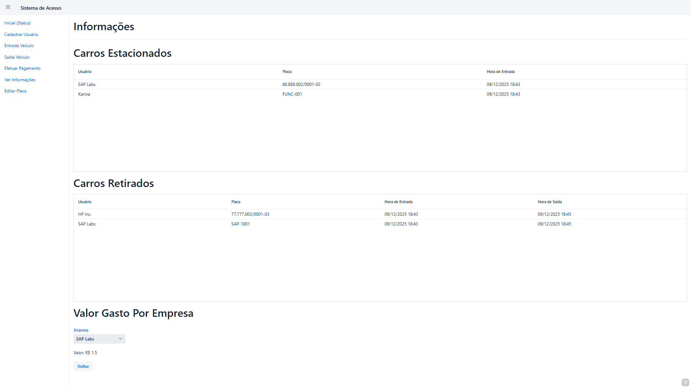

# 🚗 Sistema de Gerenciamento de Estacionamento - PUCRS


> Trabalho final da disciplina de Programação Orientada a Objetos (2025/2).

## 📋 Sobre o Projeto

Este sistema é uma aplicação web full-stack desenvolvida para gerenciar o controle de acesso e o fluxo financeiro de um estacionamento universitário (PUCRS). O foco principal do projeto foi a aplicação prática dos pilares da **Orientação a Objetos** e o uso de recursos avançados do Java.

O sistema controla a entrada e saída de veículos, aplicando regras de negócio e tarifação dinâmicas baseadas no tipo de usuário (Alunos, Funcionários e Profissionais do Tecnopuc).

## 🚀 Tecnologias Utilizadas

* **Java 17:** Linguagem base.
* **Vaadin Flow:** Framework para construção da interface web (UI) inteiramente em Java.
* **Spring Boot:** Para injeção de dependências e execução do servidor.
* **Java Collections Framework:** Listas, Mapas e Sets para gerenciamento de dados em memória.
* **Java Streams & Lambdas:** Para relatórios e processamento de dados financeiros.
* **Java Time API:** Para cálculos precisos de duração e datas.

## ⚙️ Arquitetura e Conceitos de POO Aplicados

O projeto foi estruturado seguindo as boas práticas de separação de responsabilidades e design de software:

* **Herança e Polimorfismo:**
    * Classe abstrata `Usuario` definindo o contrato básico.
    * Subclasses `Estudante`, `FuncPucrs` e `ProfissionalTecno` implementando regras específicas de cobrança e limites de veículos (`@Override`).
* **Encapsulamento:** Proteção dos dados sensíveis (como listas de placas) e acesso via métodos controlados.
* **Associação:** Relacionamento entre `ProfissionalTecno` e `Empresa`.
* **Design Pattern (Strategy/Template Method):** O cálculo do valor do estacionamento varia conforme a implementação da classe filha, transparente para o sistema principal.

## 🌟 Funcionalidades

### Controle de Acesso
- [x] **Registro de Entrada:** Validação de vaga, cadastro prévio e verificação de lotação.
- [x] **Registro de Saída:** Cálculo automático do valor a pagar baseado no tempo de permanência (com tolerância de 15min).

### Gestão de Usuários (Regras de Negócio)
* **Funcionários:** Isentos de pagamento. Limite de 2 carros.
* **Estudantes:** Tarifa fixa por acesso. Sistema de créditos/débito.
* **Profissionais (Tecnopuc):** Tarifa por hora (fração de 15min). Cobrança mensal via contrato com a empresa.

### Módulo Financeiro & Relatórios
- [x] Geração de boletos para empresas conveniadas.
- [x] Histórico de acessos filtrado por data e usuário.
- [x] Uso de Streams para agregação de dados e cálculo de receita.

## 📸 Screenshots

| Tela Inicial | Cadastro de Usuário |
|:---:|:---:|
|  |  |

| Relatório Financeiro |

|  |

## 🔧 Como Executar

1.  1.  **Clone o repositório:**
    ```bash
    git clone https://github.com/leonardondornelles/Smart-Parking-System.git
    ```
2.  **Acesse a pasta do projeto:**
    ```bash
    cd Smart-Parking-System
    ```
3.  **Execute via Maven (Spring Boot):**
    ```bash
    ./mvnw spring-boot:run
    ```
4.  **Acesse no navegador:**
    Abra `http://localhost:8080`

*Projeto desenvolvido para a disciplina de POO - PUCRS.*
